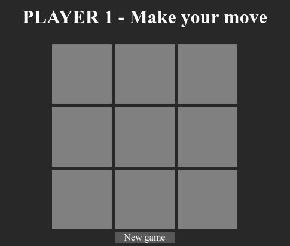
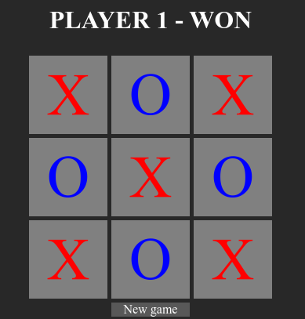
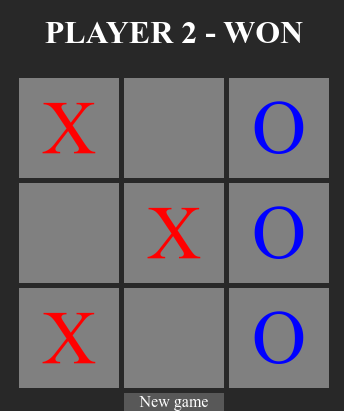
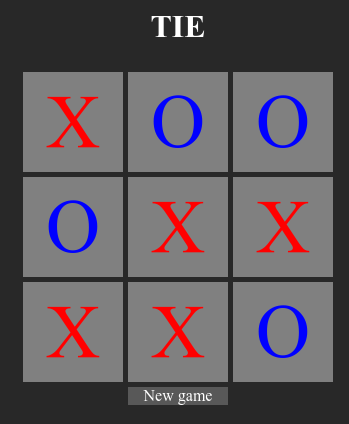

# brute-ttt

brute-ttt is a program that generates a general tree of all possible (valid) tic tac toe games
(3x3 or 2x2), then output as a tree of directories where each directory contains a html game
where it links to other games.



# Gameplay
| Player 1                  | Player 2                  | Tie
| :---:  		            | :---:    		            | :---:
| | | 

## Requirements

- Unix like system
- GCC
- GNU make

## Compiling, running and cleaning.
```sh
make                #
make run            # ./brute-ttt
make clean          # rm brute-ttt objs/brute-ttt.o
```

## Notes
- CSS to make it more appealing to the eye.
- HTML files saved on web/ directory.
- Execution of writing the html to directories: 1 minute.
- 450 MB of space.

## Made by [Sivefunc](https://gitlab.com/sivefunc)
## Licensed under [GPLv3](LICENSE)
